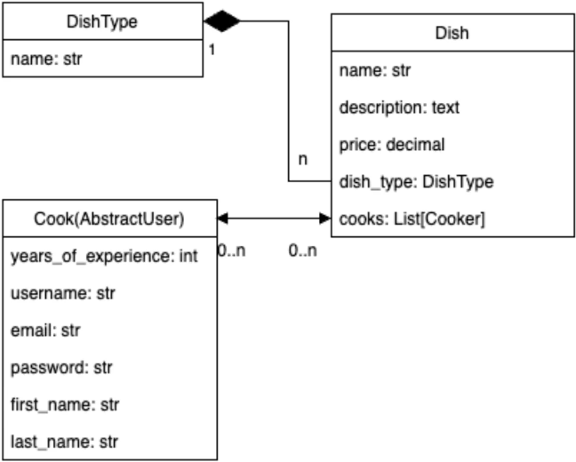
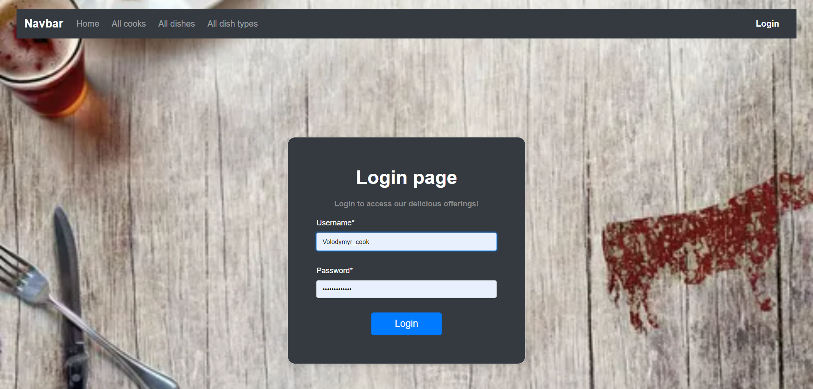
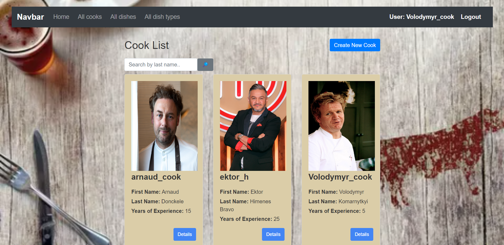
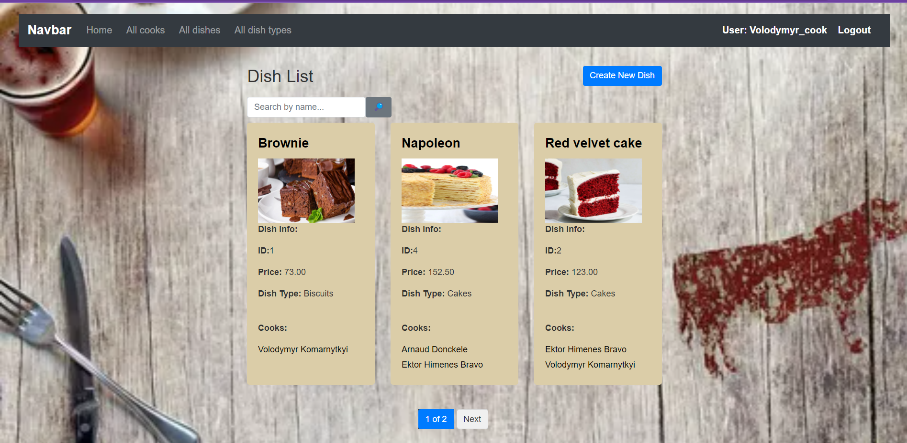
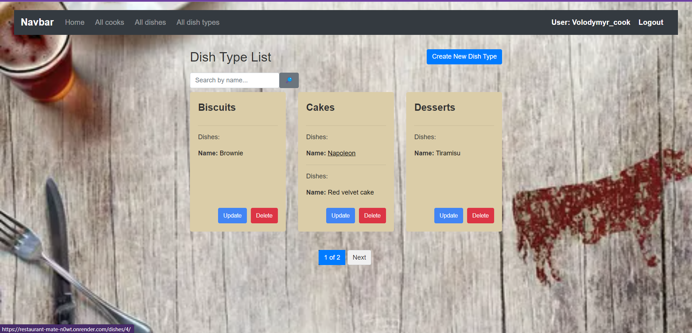
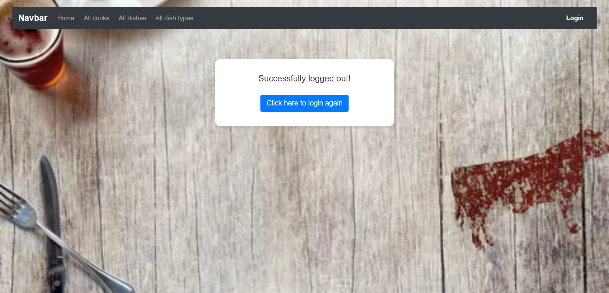

# Restaurant Kitchen Service Project

Django project for managing cooks, dishes and dish types in a restaurant

## Check it out! 
[Restaurant project deployed to Render](https://restaurant-mate-n0wt.onrender.com/)

## Installation

Python3 must be already installed

```shell
git clone https://github.com/volodymyr-komarnyckyi/restaurant-kitchen-service
cd restaurant-kitchen-service
python -m venv venv
venv\Scripts\activate (on Windows)
source venv/bin/activate (on macOS/Linux)
pip install -r requirements.txt
python manage.py runserver #starts Django Server
```

## Features

* Authentication functionality for Cook/User
* Managing cooks, dishes & dish types directly from website interface
* Powerful admin panel for advanced managing

## Default user for website

```
username: Volodymyr_cook
password: Volodymyr8204
```

## DB Structure



## Demo




.png)
.png)

.png)
.png)


